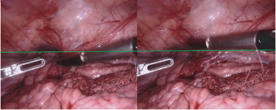

# MICCAI 2017 Robotic Instrument Segmentation toolkit

This repository contains unofficial code to assist with the use of the RIS2017
in stereo setting. Additionally this repository can be used to pre-process
the monocular RIS2017 data by cropping and de-interlacing the provided frames.

If you are using the [Robotics instrument Segmentation
2017 Endovis challenge dataset](https://endovissub2017-roboticinstrumentsegmentation.grand-challenge.org/Home/)  cite the official paper

```cite
@article{allan20192017,
  title={2017 robotic instrument segmentation challenge},
  author={Allan, Max and Shvets, Alex and Kurmann, Thomas and Zhang, Zichen and Duggal, Rahul and Su, Yun-Hsuan and Rieke, Nicola and Laina, Iro and Kalavakonda, Niveditha and Bodenstedt, Sebastian and others},
  journal={arXiv preprint arXiv:1902.06426},
  year={2019}
}
```

If this repository contains code useful to your research consider citing
[MSDESIS: Multi-task stereo disparity estimation and surgical instrument segmentation]() from which this code originates

```cite
@ARTICLE{9791423,
  author={Psychogyios, Dimitrios and Mazomenos, Evangelos and Vasconcelos, Francisco and Stoyanov, Danail},
  journal={IEEE Transactions on Medical Imaging}, 
  title={MSDESIS: Multi-task stereo disparity estimation and surgical instrument segmentation}, 
  year={2022},
  volume={},
  number={},
  pages={1-1},
  doi={10.1109/TMI.2022.3181229}}
```

## Features

The project provides code to manipulate RIS 2017 data and supports:

- Converting the provided calibration files to OpenCV format
- Stereo Rectification of images.
- De-interlacing
- Binary mask generation.
- Evaluation script for binary segmentation.


## Getting the dataset

The dataset had been made publicly available after the completion of the EndoVis challenge.
To get access you need to go to the [RIS2017 EndoVis challenge download webpage](https://endovissub2017-roboticinstrumentsegmentation.grand-challenge.org/Downloads/), 
create a user account in the grand-challenge platform, join the challenge and
follow the provided instructions on how to download the dataset.

## Dataset statistics

The table below, lists color statistics and binary segmentation pixel coverage
per dataset. Color statistics were computed only using the left frame from each
sample, after de-interlacing and cropping it. The range is normalized from 0-255
to 0-1.

|        Dataset        | Mean  |       |       | Stdev |       |       | Coverage |
| :-------------------: | :---: | :---: | :---: | :---: | :---: | :---: | :------: |
|                       |  Red  | Green | Blue  |  Red  | Green | Blue  |    %     |
| instrument_dataset_1  | 0.510 | 0.318 | 0.354 | 0.187 | 0.161 | 0.175 |  0.167   |
| instrument_dataset_2  | 0.482 | 0.318 | 0.367 | 0.154 | 0.144 | 0.161 |  0.132   |
| instrument_dataset_3  | 0.463 | 0.300 | 0.324 | 0.209 | 0.184 | 0.195 |  0.160   |
| instrument_dataset_4  | 0.531 | 0.313 | 0.351 | 0.161 | 0.150 | 0.162 |  0.155   |
| instrument_dataset_5  | 0.494 | 0.324 | 0.380 | 0.184 | 0.173 | 0.196 |  0.135   |
| instrument_dataset_6  | 0.469 | 0.291 | 0.317 | 0.193 | 0.169 | 0.188 |  0.153   |
| instrument_dataset_7  | 0.443 | 0.309 | 0.336 | 0.190 | 0.175 | 0.195 |  0.143   |
| instrument_dataset_8  | 0.503 | 0.284 | 0.348 | 0.187 | 0.150 | 0.174 |  0.164   |
| instrument_dataset_9  | 0.509 | 0.324 | 0.371 | 0.141 | 0.130 | 0.146 |  0.106   |
| instrument_dataset_10 | 0.492 | 0.293 | 0.321 | 0.190 | 0.151 | 0.168 |  0.125   |
|        Average        | 0.489 | 0.307 | 0.347 | 0.180 | 0.159 | 0.176 |  0.144   |

## Calibration

- Extrinsic Rotation matrix

The provided calibration includes a three value entry named `Extrinsic-Omega`
which describes to the rotation from left to right camera frame. Assuming that
the rotation is expressed using the Rodrigues' formula, the scripts convert 3x3
`Extrinsic-Omega` to a rotation matrix which are later used for stereo rectification

## Data processing

### Sample image Dimensions

Based on the provided calibration parameters, albeit the frame size is
indicated to be `1280x1024`, the provided samples are of size `1920x1080` with
the rgb image places in the middle of the samples and black borders around it.
Center cropping the frames to `1280x1024`, results to images with back borders.
To remove the borders completely and to make use of the provided calibration
we crop frames to `1263x1009` starting from pixel `328,37`.

### Interlacing

Sample are extracted from interlaced video. This results to artifacts
whenever an object is moving fast between frames. Because the full
video sequence is not provided, we are limited to simple de-interlacing techniques
where we delete odd image rows and interpolate their values based color information
of the even lines.

## Issues related to stereo reconstruction

### Imperfect time Synchronization between stereo channels

The left and right view are not synchronized in time. This can be easily seen in
views where a tool is moving fast in the vertical direction.
Dataset 1- Frame 207



### Calibration Accuracy

Using the provided calibration files to stereo rectify the dataset we find the
the following:

- Datasets 3,6 exhibit vertical disparity of around 20 pixels after stereo
 rectification.
- Datasets 5,7,8,9,10 exhibit vertical disparity around 5 pixels after stereo
 rectification.
- Datasets 1,2 and 4 do not exhibit visible vertical disparity after stereo
rectification.

## How to run the code

### Environment setup

This project was build using anaconda. Assuming that anaconda is already installed
create an environment by running:

```bash
conda create --name ris_toolkit --file requirements.txt
conda activate ris_toolkit
```

### Data generation

After downloading the data, you need to re-arrange the files such that they follow
the file structure below.

```tree
.
├── train_set                       # folder containing train samples
│   └── instrument_dataset_i        # i corresponds to dataset number (0-8)
│       ├── left_frame              # dir containing left frames
│       ├── right_frame             # dir containing right frames
│       ├── ground_truth 
│       │   └── label_1             # dir contains ground truth labels for tool 1
│       │   └── label_n             # dir contains ground truth labels for tool n
│       ├── mappings.json
│       └── camera_calibration.txt  # 12 line calibration file.
└── test_set                        # folder containing test samples
    └── instrument_dataset_i        # i corresponds to dataset number (0-10)
        ├── left_frame              # dir containing left frames
        ├── right_frame             # dir containing right frames
        ├── ground_truth 
        │   └── label_1             # dir contains ground truth labels for tool 1
        │   └── label_n             # dir contains ground truth labels for tool n
        ├── mappings.json
        └── camera_calibration.txt  # 12 line calibration file.
```

The following scripts generate a processed  version of the RIS_2017 dataset
following the above file structure. The stereo rectified frames new dataset will
be de-interlaced, cropped and interpolated to `1280x1024`.
Additionally a stereo_calib.json, OpenCV compatible, calibration file will be
generated containing both the provided calibration parameters and the stereo
rectification matrices in OpenCV format. The rectification cropping can be
adjusted using the `--rect_alpha` flag.

To create the a stereo rectified dataset de-interlaced and cropped to 1280x1024
dataset,use the following script for the test and training sequence respectively

```bash
python -m scripts.generate_stereo_binary_dataset /path_to_original/train_set /path_to_store_the_new/train_set --alpha_rect -1
python -m scripts.generate_stereo_binary_dataset /path_to_original/test_set /path_to_store_the_new/test_set --alpha_rect -1
```

To create the a monocular de-interlaced and cropped to 1280x1024 dataset,
use the following script for the test and training sequence respectively

```bash
python -m scripts.generate_clean_monocular_dataset /path_to_original/train_set /path_to_store_the_new/train_set 
python -m scripts.generate_clean_monocular_dataset /path_to_original/test_set /path_to_store_the_new/test_set 
```

### Generate Sample CSV

To generate a csv file containing a list of all left, right images and binary
segmentation masks under a specific folder recursively you can use the following
script

- The `--binary` flag dictates if the outcome .csv file will contain ground truth
binary segmentation masks as the third column.

```bash
python -m scripts.generate_io_csv.py path/to/dataset ./path/to/write/csv [--binary]
```

### Evaluate Binary Segmentation

You can use this script to validate predictions using IoU metric. The script will
compute a score fore every dataset in the test sequence

```bash
python -m scripts.evaluate  --gt_dir /path/to/test/dataset/root/dir --algorithm_output_dir /path/to directory/samples/for/eval/are/stored 
```
