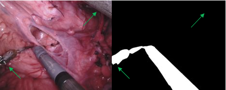

# MICCAI 2017 Robotic Instrument Segmentation toolkit

## Features

The project provides code to manipulate RIS 2017 data and supports:

- [x] Porting calibration files to OpenCV format
- [x] Stereo Rectification of sample Data.
- [x] sample De-interlacing
- [x] Segmentation mask combination.
- [x] Binary tool segmentation dataset generation
- [x] generation of .csv file containing samples paths.
- [x] compute dataset statistics
- [x] evaluation script for binary segmentation.

## Known issues

- the dataset generation program assumes that the original dataset is stored
with a specific file structure, different from the one it's provided.
- stereo rectifying segmentation masks, there might be ambiguous mask values near
tool boarders. This is due to interpolation and could get fixed by
discretizing the mask after rectification.

## Notes on the Dataset

### Dataset statistics

The table below, lists color statistics and binary segmentation pixel coverage 
per dataset. Color statistics were computed only using the left frame from each 
sample, after de-interlacing and cropping it. The statistics corresponds to images
in range 0-1.

<table class="tg">
<thead>
  <tr>
    <th class="tg-c3ow">Dataset</th>
    <th class="tg-c3ow" colspan="3">Mean</th>
    <th class="tg-c3ow" colspan="3">Stdev</th>
    <th class="tg-c3ow">Coverage</th>
  </tr>
</thead>
<tbody>
  <tr>
    <td class="tg-0pky"></td>
    <td class="tg-c3ow">Red</td>
    <td class="tg-c3ow">Green</td>
    <td class="tg-c3ow">Blue</td>
    <td class="tg-c3ow">Red</td>
    <td class="tg-c3ow">Green</td>
    <td class="tg-c3ow">Blue</td>
    <td class="tg-c3ow">%</td>
  </tr>
  <tr>
    <td class="tg-0pky">instrument_dataset_1</td>
    <td class="tg-c3ow">0.5103</td>
    <td class="tg-c3ow">0.3187</td>
    <td class="tg-c3ow">0.3548</td>
    <td class="tg-c3ow">0.1870</td>
    <td class="tg-c3ow">0.1610</td>
    <td class="tg-c3ow">0.1752</td>
    <td class="tg-c3ow">0.1671</td>
  </tr>
  <tr>
    <td class="tg-0pky">instrument_dataset_2</td>
    <td class="tg-c3ow">0.4821</td>
    <td class="tg-c3ow">0.3185</td>
    <td class="tg-c3ow">0.3677</td>
    <td class="tg-c3ow">0.1545</td>
    <td class="tg-c3ow">0.1443</td>
    <td class="tg-c3ow">0.1613</td>
    <td class="tg-c3ow">0.1321</td>
  </tr>
  <tr>
    <td class="tg-0pky">instrument_dataset_3</td>
    <td class="tg-c3ow">0.4631</td>
    <td class="tg-c3ow">0.3008</td>
    <td class="tg-c3ow">0.3243</td>
    <td class="tg-c3ow">0.2093</td>
    <td class="tg-c3ow">0.1848</td>
    <td class="tg-c3ow">0.1955</td>
    <td class="tg-c3ow">0.1601</td>
  </tr>
  <tr>
    <td class="tg-0pky">instrument_dataset_4</td>
    <td class="tg-c3ow">0.5310</td>
    <td class="tg-c3ow">0.3134</td>
    <td class="tg-c3ow">0.3513</td>
    <td class="tg-c3ow">0.1618</td>
    <td class="tg-c3ow">0.1507</td>
    <td class="tg-c3ow">0.1624</td>
    <td class="tg-c3ow">0.1550</td>
  </tr>
  <tr>
    <td class="tg-0pky">instrument_dataset_5</td>
    <td class="tg-c3ow">0.4948</td>
    <td class="tg-c3ow">0.3242</td>
    <td class="tg-c3ow">0.3802</td>
    <td class="tg-c3ow">0.1840</td>
    <td class="tg-c3ow">0.1734</td>
    <td class="tg-c3ow">0.1963</td>
    <td class="tg-c3ow">0.1358</td>
  </tr>
  <tr>
    <td class="tg-0pky">instrument_dataset_6</td>
    <td class="tg-c3ow">0.4697</td>
    <td class="tg-c3ow">0.2912</td>
    <td class="tg-c3ow">0.3174</td>
    <td class="tg-c3ow">0.1931</td>
    <td class="tg-c3ow">0.1693</td>
    <td class="tg-c3ow">0.1882</td>
    <td class="tg-c3ow">0.1535</td>
  </tr>
  <tr>
    <td class="tg-0pky">instrument_dataset_7</td>
    <td class="tg-c3ow">0.4434</td>
    <td class="tg-c3ow">0.3096</td>
    <td class="tg-c3ow">0.3364</td>
    <td class="tg-c3ow">0.1909</td>
    <td class="tg-c3ow">0.1759</td>
    <td class="tg-c3ow">0.1951</td>
    <td class="tg-c3ow">0.1433</td>
  </tr>
  <tr>
    <td class="tg-0pky">instrument_dataset_8</td>
    <td class="tg-c3ow">0.5033</td>
    <td class="tg-c3ow">0.2843</td>
    <td class="tg-c3ow">0.3484</td>
    <td class="tg-c3ow">0.1879</td>
    <td class="tg-c3ow">0.1503</td>
    <td class="tg-c3ow">0.1746</td>
    <td class="tg-c3ow">0.1640</td>
  </tr>
  <tr>
    <td class="tg-0pky">instrument_dataset_9</td>
    <td class="tg-c3ow">0.5091</td>
    <td class="tg-c3ow">0.3248</td>
    <td class="tg-c3ow">0.3716</td>
    <td class="tg-c3ow">0.1418</td>
    <td class="tg-c3ow">0.1308</td>
    <td class="tg-c3ow">0.1467</td>
    <td class="tg-c3ow">0.1063</td>
  </tr>
  <tr>
    <td class="tg-0pky">instrument_dataset_10</td>
    <td class="tg-c3ow">0.4928</td>
    <td class="tg-c3ow">0.2930</td>
    <td class="tg-c3ow">0.3218</td>
    <td class="tg-c3ow">0.1900</td>
    <td class="tg-c3ow">0.1514</td>
    <td class="tg-c3ow">0.1682</td>
    <td class="tg-c3ow">0.1257</td>
  </tr>
  <tr>
    <td class="tg-0pky">Average</td>
    <td class="tg-c3ow">0.4899</td>
    <td class="tg-c3ow">0.3078</td>
    <td class="tg-c3ow">0.3474</td>
    <td class="tg-c3ow">0.1800</td>
    <td class="tg-c3ow">0.1592</td>
    <td class="tg-c3ow">0.1763</td>
    <td class="tg-c3ow">0.1443</td>
  </tr>
</tbody>
</table>

### Calibration

- Extrinsic Rotation matrix

The provided calibration includes a three value entry named `Extrinsic-Omega`
which describes to the rotation from left to right camera frame. Assuming that
the rotation is expressed using the Prorogues' formula, we converted to a 3x3
Rotation matrix and use it for stereo rectification.

- Calibration Errors

Using the calibration files provided with with datasets 3 and 6 to rectify
the stereo pairs, results to poor stereo rectifications where corresponding features
do not lie in the same scan-lines. The calibration of datasets 5,7,8,9 and 10 are
mostly ok but they are not very accurate. calibration files for datasets 1,2 and 4 
are ok.

### Data format

- Sample image Dimensions

Based on the provided calibration parameters, albeit the frame size is
indicated to be `1280x1024`, the provided samples are of size `1920x1080` with
the rgb image places in the middle of the samples and black borders around it.
Center cropping the frames to `1280x1024`, results, again, to images with borders.

- Interlacing

Sample are extracted from interlaced video frames. This results to artifacts
whenever an object is moving fast between frames. Furthermore, because the full
video sequence is not provided, we are limited to simple de-interlacing techniques.
An additional issue comes from the fact that the provided samples are not
provided in the original size(`1280x1024`) as explain in the above section.

### Sample issue

- Time Synchronization

The left and right view are not synchronized in time. This can be easily seen in
views where a tool is moving fast in the vertical direction. In addition to the
interlacing artifacts, tools do not appear to be in the same scanlines.

Dataset 1- Frame 207

- Ground truth

There are are frames with missing masks for some parts of tools. Most of those
samples have been found in dataset 8. In addition, mask are not exact and often
they include tissue or do not include the whole tool area.

Dataset8 - Frame 72

### Solution

- Data format

To remove the borders completely and make to make use of the provided calibration
we crop frames to `1263x1009` starting from pixel `328,37`.
Next, we de-interlace the the rgb samples which results to two frames, for each
stereo channel, with half the vertical resolution of the original interlaced frame.
We keep the first frame and resize it to `1280x1024` interpolating the missing
lines.
Segmentation marks are cropped and to `1009x1263` image and up-sampled to `1280x1024`.

## Dataset statistics

The table below lists dataset statistics computed using the provided code. 
Both train and test samples were used to calculate the color and binary coverage.
The last row is the mean across statistics computed for each

## How to run the code

### Environment setup

This project was build using anaconda. Assuming that anaconda is already installed
in the target machine, a anaconda environment suitable to run this code can be
created using the following steps.

- navigate to this project's folder
- create an environments (e.g. ris_toolkit) using the provided requirements.txt

    `conda create --name ris_toolkit --file requirements.txt`
- activate the anaconda environment

    `conda activate ris_toolkit`
- generate the data as described in the following section.

### Data generation and cleaning

Assuming that the original dataset follows the following file structure.

    .
    ├── train_set                       # folder containing train samples
    │   └── instrument_dataset_i        # i corresponds to dataset number (0-8)
    │       ├── left_frame              # dir containing left frames
    │       ├── right_frame             # dir containing right frames
    │       ├── ground_truth 
    │       │   └── label_1             # dir contains ground truth labels for tool 1
    │       │   └── label_n             # dir contains ground truth labels for tool n
    │       ├── mappings.json
    │       └── camera_calibration.txt  # 12 line calibration file.
    └── test_set                        # folder containing test samples
        └── instrument_dataset_i        # i corresponds to dataset number (0-10)
            ├── left_frame              # dir containing left frames
            ├── right_frame             # dir containing right frames
            ├── ground_truth 
            │   └── label_1             # dir contains ground truth labels for tool 1
            │   └── label_n             # dir contains ground truth labels for tool n
            ├── mappings.json
            └── camera_calibration.txt  # 12 line calibration file.

the following program creates a modified dataset following the above file structure.
The new dataset will contain stereo rectified frames (based on `--rect_alpha`)
de-interlaced cropped and interpolated to `1280x1024` as described above.
Additionally a stereo_calib.json, OpenCV compatible, calibration file will be
generated, in place of camera_calibration.txt. This calibration file contains
original the stereo parameters plus the computed rectification parameters.

    python generate_stereo_binary_dataset.py /path_to_original/train_set /path_to_store_the_new/train_set --alpha_rect -1
    python generate_stereo_binary_dataset.py /path_to_original/test_set /path_to_store_the_new/test_set --alpha_rect -1

    python generate_clean_monocular_dataset.py /path_to_original/train_set /path_to_store_the_new/train_set 
    python generate_clean_monocular_dataset.py /path_to_original/test_set /path_to_store_the_new/test_set 

### Generate Sample CSV

    python generate_io_csv.py /to/dataset ./path/to/write/csv [--binary] [--disparity] 

### Evaluate Binary Segmentation

    python evaluate.py  --gt_dir /path/to/test/dataset/root/dir --algorithm_output_dir /path/to directory/samples/for/eval/are/stored 
